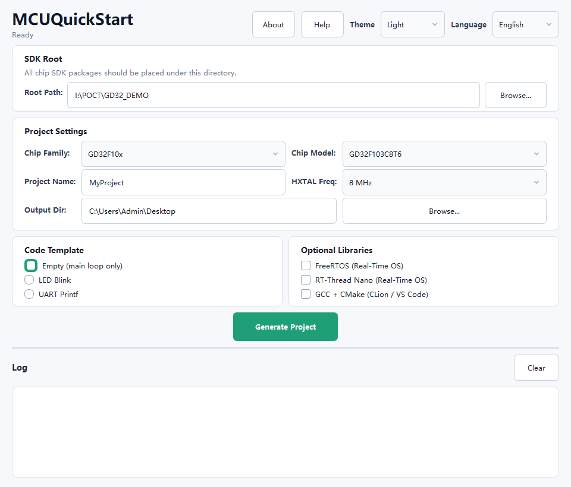
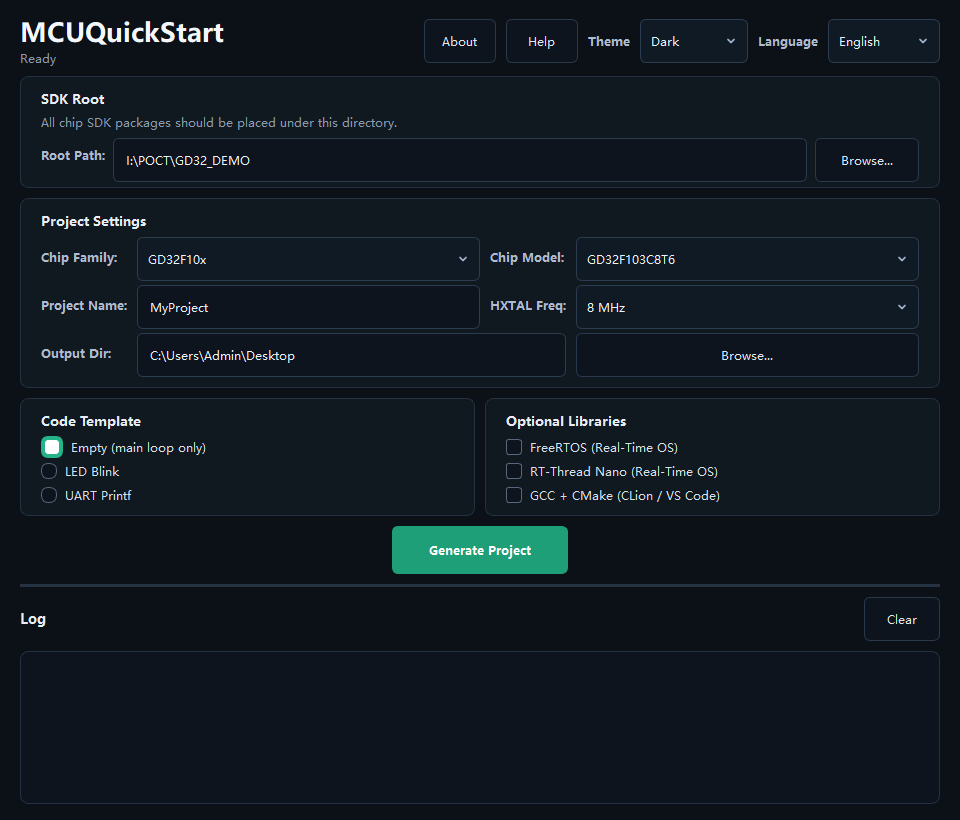

# MCUQuickStart

面向 STM32 / GD32 的一键 MCU 工程生成工具。

选择芯片、选择模板，按需勾选 FreeRTOS / RT-Thread Nano / GCC+CMake，然后在一分钟内生成可直接编译的 Keil 或 CMake 工程。

[English README](README.md)

| 亮色主题 | 暗黑主题 |
| --- | --- |
|  |  |

## 为什么做这个工具

嵌入式工程搭建本身不难，但很浪费时间，而且细节非常容易错：

- 在 SDK 目录里找固件库、CMSIS 头文件、启动文件和模板文件
- 手动创建 Keil 工程，逐个添加文件组和 include 路径
- 查数据手册配置 RAM/ROM 地址、Flash 下载算法和预处理宏
- 移植 FreeRTOS / RT-Thread Nano 时处理 SysTick、PendSV、堆、ARMCC V5/C90 兼容问题
- 给 CLion / VS Code 手写 GCC+CMake、链接脚本和启动文件适配

MCUQuickStart 的目标就是把这些重复工作变成几个清晰的选项。

## 核心功能

| 功能 | 说明 |
| --- | --- |
| 芯片感知工程生成 | 自动配置启动文件、设备宏、内存映射、Flash 算法和 include 路径 |
| Keil MDK 工程输出 | 自动生成完整 `.uvprojx` 工程和文件分组 |
| GCC + CMake 输出 | 自动生成 `CMakeLists.txt`、链接脚本，并查找 GCC 启动文件 |
| FreeRTOS 集成 | 自动复制内核、Cortex-M3/M4F port、heap_4 和 `FreeRTOSConfig.h` |
| RT-Thread Nano 集成 | 自动生成 `rtconfig.h`、`board.c`、中断适配，并处理 ARMCC V5/C90 兼容 |
| SDK 自动识别 | 自动匹配 SDK 目录，支持首次运行解压 `.zip` / `.7z` |
| 外部晶振选择 | 支持 8 MHz / 25 MHz HXTAL，并自动修正相关时钟宏 |
| 明暗主题 UI | PyQt6 界面，支持 Light / Dark 主题切换 |

## 支持芯片

目前支持 4 个系列，共 37 个型号：

| 系列 | 内核 | 厂商 | 型号数 |
| --- | --- | --- | --- |
| STM32F10x | Cortex-M3 | STMicroelectronics | 9 |
| STM32F4xx | Cortex-M4 | STMicroelectronics | 6 |
| GD32F10x | Cortex-M3 | GigaDevice | 8 |
| GD32F4xx | Cortex-M4 | GigaDevice | 14 |

## 工程模板

- **空工程**：最小 `main()`，适合作为干净起点
- **LED 闪烁**：GPIO 初始化和延时，适合快速验证硬件
- **串口打印**：USART printf 重定向，适合调试输出

每个模板都可以生成裸机、FreeRTOS 或 RT-Thread Nano 工程，也可以同时生成 GCC+CMake 工程。

## 快速开始

1. 从 [Releases](https://github.com/Majie-xixi/MCUQuickStart/releases) 下载 `MCUQuickStart.exe`。
2. 将芯片 SDK 包放到同一个目录下。
3. 启动 MCUQuickStart，将该目录设置为 **SDK Root**。
4. 选择芯片系列、芯片型号、项目名称、输出目录和代码模板。
5. 按需勾选 FreeRTOS、RT-Thread Nano 或 GCC+CMake。
6. 点击 **Generate Project**。
7. 用 Keil MDK V5 打开生成的 `.uvprojx` 编译，或用 CLion / VS Code 打开 CMake 工程。

## SDK 准备

将以下官方 SDK 包放在同一个 SDK 根目录下：

| SDK 包 | 用途 |
| --- | --- |
| `STM32F10x_StdPeriph_Lib` | STM32F1 工程 |
| `STM32F4xx_DSP_StdPeriph_Lib` | STM32F4 工程 |
| `GD32F10x_Firmware_Library` | GD32F1 工程 |
| `GD32F4xx_Firmware_Library` | GD32F4 工程 |
| FreeRTOS Kernel V10.x | 可选，FreeRTOS 工程 |
| RT-Thread Nano V3.x | 可选，RT-Thread Nano 工程 |

工具会自动搜索常见 SDK 目录结构。SDK 根目录下的 `.zip` / `.7z` 压缩包也可以在首次使用时自动解压。

## 典型场景

- 新板子到手，快速生成 LED 工程验证硬件
- 对比 STM32 和 GD32 标准外设库 API 差异
- 给新同事一个可直接编译的 Keil 工程，减少环境搭建成本
- 在支持芯片上快速尝试 FreeRTOS 或 RT-Thread Nano
- 官方示例偏 Keil，但你想用 CLion / VS Code 写代码

## 版本亮点

### v1.3.0

- RT-Thread Nano 一键工程生成
- 针对 RT-Thread Nano 的 ARMCC V5 / C90 兼容处理
- SDK `.zip` / `.7z` 自动解压
- About 对话框，包含 GitHub / Gitee 链接

### v1.2.0

- GCC + CMake 工程生成
- STM32 / GD32 自动选择对应链接脚本
- GCC 启动文件智能查找，支持 GD32 Embedded Builder 兜底
- GCC 构建时抑制厂商 SDK 噪声警告，保留用户代码警告

### v1.1.0

- FreeRTOS 一键集成
- 外部晶振频率选择
- GD32F470 系列支持
- 内置中英文帮助

## 从源码运行

```bash
pip install -r requirements.txt
python main.py
```

GUI 基于 PyQt6。

## 后续方向

- 支持更多芯片系列
- 增加更多板级模板
- 为带以太网的 MCU 增加可选 lwIP 集成
- 增加更多 RTOS 示例工程

## 许可

个人、教育和非商业用途免费。

商业用途，包括但不限于销售、捆绑到付费产品中、作为付费服务提供等，需要获得作者明确授权。

## Star

如果这个工具帮你节省了时间，欢迎给一个 Star，让更多嵌入式开发者发现它。
